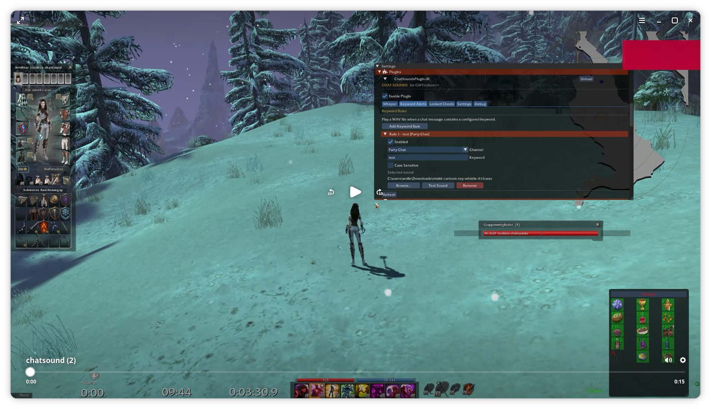

# ChatSoundsPlugin (Deutsch)

> Ein leichtgewichtiges Plugin für GWToolbox++, das benutzerdefinierte Benachrichtigungstöne für Whisper und frei definierbare Chat-Schlagwörter abspielt
> Es kann auch Sounds bei "entdeckten" Truhen abspielen

---

## Features

### Deutsch
- 🔔 Eigene Sounds für gedroppte Item anhand der Modelid oder Name des Items
- 🔔 Eigene Sounds bei eingehenden Whispernachrichten
- 🔔 Eigene SOunds bei "verschlossenen Truhen" in Kompassrange
- 💬 Beliebig viele Schlagwort-Regeln und jeweils eigene Sounds 🎵 dazu
  - 🎯 Filter nach Chatkanal
  - Alle
  - Lokal
  - Gilde
  - Allianz
  - Gruppe
  - Handel
  - Whisper
- 🧪 Test-Button für jeden Sound
- 🔠 Optionale Groß-/Kleinschreibung
- ⏱ Globaler Sound-Cooldown sowie Lautstärkenanpassung unter Settings
- 💾 Automatisches Speichern aller Einstellungen(wird gespeichert wenn die toolboxsettings gespeichert werden)
- ⚡ Asynchrone Audiowiedergabe ohne Guild Wars zu blockieren
- Gute Quelle für wav-files ohne sich registrieren zu müssen 'https://mixkit.co/'
  
---
# Short Clip showing alert and chest sound
[](https://raw.githubusercontent.com/solos-github/gwtoolbox-plugin-chatsounds/main/chatsound.mp4)


---
# Screenshots
## Item Drops


## Whisper


## Keyword Alerts


## Locked Chests


## Settings 


# Installation (Vorkompilierte DLL)

Die aktuelle DLL `ChatSoundsPlugin.dll` hier https://github.com/solos-github/gwtoolbox-plugin-chatsounds/releases/tag/dll herunterladen.

## 1. Plugin-Ordner öffnen

Öffne dein GWToolbox++-Verzeichnis und wechsle in den Ordner

```GWToolboxpp/
└── randomtoolboxid xxxxx/
└── plugins/
```

Falls der Ordner nicht existiert, kannst du ihn einfach erstellen.

## 2. Plugin kopieren

Kopiere zuvor heruntergeladene ChatSoundsPlugin.dll


nach

```text
GWToolboxpp/
└── randomtoolboxid xxxxx/
└── plugins/
    └── ChatSoundsPlugin.dll
```

## 3. Guild Wars starten

Starte Guild Wars wie gewohnt zusammen mit GWToolbox++.

Das Plugin wird beim Start automatisch geladen.

## 4. Plugin konfigurieren

Öffne

```
GWToolbox
→ Settings
→ Plugins
→ Chat Sounds
```

Dort kannst du:

- Whisper-Benachrichtigungen aktivieren
- Schlagwort-Regeln erstellen
- Chatkanäle auswählen
- Eigene WAV-Dateien verwenden (Ich habe unter #releases ein paar Beispiel WAV-files abgelegt)
- Sounds testen
- Den Sound zu verschlossenen Truhen hinterlegen
- Den globalen Cooldown einstellen

### Aktualisieren

1. Guild Wars schließen.
2. Die vorhandene `ChatSoundsPlugin.dll` durch die neue Version ersetzen.
3. Guild Wars erneut starten.

Alle Einstellungen bleiben erhalten.

### Entfernen

Lösche

```text
plugins/ChatSoundsPlugin.dll
```

und starte Guild Wars erneut.

Das Plugin wird anschließend nicht mehr geladen.

---


# Entwickler-Voraussetzungen

- Windows oder Linux (Wine)
- Guild Wars
- GWToolbox++
- Visual Studio 2022
- CMake
- vcpkg

---


# Kompilieren (Quellcode)

Kopiere das Plugin in den GWToolbox++-Quellcode:

```text
GWToolboxpp/
└── plugins/
    └── ChatSoundsPlugin/
        ├── ChatSoundsPlugin.cpp
        └── ChatSoundsPlugin.h
```

Registriere das Plugin in

```text
cmake/gwtoolboxdll_plugins.cmake
```

```cmake
add_tb_plugin(ChatSoundsPlugin)

target_link_libraries(ChatSoundsPlugin PRIVATE
    winmm
    comdlg32
)
```

Konfigurieren:

```powershell
cmake --preset=vcpkg
```

Kompilieren:

```powershell
cmake --build build --config RelWithDebInfo --target ChatSoundsPlugin
```

Die fertige DLL befindet sich anschließend unter:

```text
bin/RelWithDebInfo/ChatSoundsPlugin.dll
```

---

# Verwendung

## Whisper-Benachrichtigung

1. Whisper-Sound aktivieren
2. WAV-Datei auswählen
3. Mit **Test** überprüfen

## Schlagwort-Regeln

Für jede Regel können folgende Optionen festgelegt werden:

- Chatkanal
- Suchbegriff
- WAV-Datei
- Optionale Groß-/Kleinschreibung

Beispiel:

| Kanal | Schlagwort | Sound |
|--------|------------|-------|
| Gilde | DoA | guild.wav |
| Handel | Obsidian | trade.wav |
| Alle | Ecto | ecto.wav |

Sobald eine passende Nachricht erscheint, wird der konfigurierte Sound abgespielt.

---


# Unterstützte Audioformate

Aktuell unterstützt:

- WAV

Empfohlen:

- PCM
- 16 Bit
- 44,1 kHz

---

# Technische Details

Das Plugin verwendet dieselben UI-Callbacks wie der integrierte ChatFilter von GWToolbox++:

- `kPrintChatMessage`
- `kPlayerChatMessage`

Dadurch bleibt das Plugin mit aktuellen Versionen von GWToolbox++ kompatibel und benötigt keine Paketmanipulation.

Die Audiowiedergabe erfolgt asynchron über die Windows Multimedia API (`PlaySoundW`).

---


# Kompatibilität

Entwickelt für aktuelle Versionen von GWToolbox++ mit:

- `ToolboxPlugin`
- `RegisterUIMessageCallback`
- `GW::HookEntry`

Ältere Versionen der Toolbox benötigen möglicherweise kleinere Anpassungen.

---


# Mitwirken

Pull Requests, Verbesserungsvorschläge und Fehlermeldungen sind jederzeit willkommen.

---


# Lizenz

MIT License

---

# Hinweis

Guild Wars® ist eine eingetragene Marke von ArenaNet, LLC.

Dieses Projekt ist ein unabhängiges Community-Plugin und steht in keiner Verbindung zu ArenaNet.
